<div align="center">



```
┌──────────────────────────────────────┐
│  $ ./boot --profile                  │
│  [ OK ] kernel ........ curiosity    │
│  [ OK ] shell ......... zsh/bash     │
│  [ OK ] editor ........ neovim       │
│  [ OK ] mindset ....... adversarial  │
│  [ OK ] distro ........ arch (btw)   │
│  [ .. ] loading ....... next project │
└──────────────────────────────────────┘
```

# 〈 RAJA LAIRENMAYUM 〉

**MCA student · systems, AI & security · Linux tinkerer**

I don't just use computers. I take them apart, rebuild them, break them (legally), and figure out how to harden them.

</div>

---

## `> whoami`

I'm an MCA Computer Science student who likes working close to the machine. I write C and C++ when I want to understand what's really happening, Python when I want to move fast on AI and data problems, and JavaScript when an idea needs an interface.

Security is the thread that ties it together for me. Once you know how memory, processes, and networks really work, you start seeing where they fail. I'm learning cybersecurity hands-on through labs, CTF-style challenges, and reading how real vulnerabilities work, always in environments I own or am authorized to test.

My daily driver is **Arch Linux**, configured by hand, because I'd rather understand my system than treat it as a black box. Most of my free time goes into Neovim configs, shell setups, kernel-adjacent reading, and building small tools that make my workflow faster.

I'm an anime fan too. It shows up in my setup and in how I name things, but the code stays serious.

---

## `> system --status`

| | |
|---|---|
| **Role** | MCA Computer Science student |
| **Focus** | System programming · Cybersecurity · AI · Data science |
| **Platform** | Arch Linux |
| **Mode** | Building, breaking, learning |
| **Open to** | Internships · collaboration · interesting problems |

---

## `> cat loadout.conf`

**Languages**


**Environment**


**Core interests**

`System Programming` · `Cybersecurity` · `Artificial Intelligence` · `Data Science` · `Linux Internals` · `Algorithms` · `Developer Tools`

<!--
OPTIONAL: add only what you genuinely use, e.g.
GDB · Valgrind · Makefile · tmux · NumPy · pandas · scikit-learn · PyTorch · Node.js
Security (only what you actually use): Wireshark · nmap · Ghidra · Burp Suite · Metasploit
-->

---

## `> ls ~/projects`

> Each entry answers: *what is it, why did I build it, and what was hard?*

### 01 · `PROJECT_NAME`
*One-line description of what it does.*

| | |
|---|---|
| **Stack** | `C` · `Linux` *(replace)* |
| **Why I built it** | The itch that started it. |
| **Hard part** | The technical challenge and how you approached it. |
| **Repo** | [github.com/username/project](https://github.com/username/project) |

### 02 · `PROJECT_NAME`
*One-line description of what it does.*

| | |
|---|---|
| **Stack** | `Python` · `AI` *(replace)* |
| **Why I built it** | The motivation. |
| **Hard part** | A real challenge you solved. |
| **Repo** | [github.com/username/project](https://github.com/username/project) |

### 03 · `PROJECT_NAME`
*One-line description of what it does.*

| | |
|---|---|
| **Stack** | `C++` · `CMake` *(replace)* |
| **Why I built it** | The motivation. |
| **Hard part** | A real challenge you solved. |
| **Repo** | [github.com/username/project](https://github.com/username/project) |

<details>
<summary><b>Dotfiles & system config</b></summary>

My Arch + Neovim + shell setup, kept in version control: [github.com/username/dotfiles](https://github.com/username/dotfiles) *(replace or delete)*

</details>

---

## `> cat dev-notes/README.md`

I keep a log of problems I run into and how I solved them, so I don't solve the same thing twice. Each note covers the problem, what I tried, the fix, and why it worked.

| Folder | What goes in it |
|---|---|
| `linux/` | Arch quirks, boot and package issues, config fixes |
| `c-cpp/` | Segfaults, memory bugs, build-system problems |
| `python/` | Data and AI scripting problems |
| `security/` | Lab and CTF writeups |

**Repo:** [github.com/username/dev-notes](https://github.com/username/dev-notes) *(create it, then replace)*

---

## `> sudo ./security --track`

The security side of my learning, and where I'll publish it.

| | |
|---|---|
| **Areas** | Linux security · networking fundamentals · memory safety · reverse engineering basics · web security basics |
| **Practice** | Home lab · CTF-style challenges *(add platform, e.g. TryHackMe / Hack The Box, if you use it)* |
| **Writeups** | [dev-notes/security](https://github.com/username/dev-notes/tree/main/security) *(replace or delete until you have some)* |
| **Tooling** | Small scripts and tools I write in Python / C for recon, parsing, and analysis *(link a real one)* |

> All testing is done in my own lab or on explicitly authorized targets.

---

## `> tail -f quest.log`

**Currently exploring**, and not claiming mastery of any of it yet:

- `[~]` System programming in C/C++: memory, processes, syscalls
- `[~]` Linux internals: how the kernel, init, and userspace fit together
- `[~]` Cybersecurity: memory-safety bugs, reverse engineering basics, network analysis
- `[~]` Secure coding in C/C++: understanding how bugs become vulnerabilities
- `[~]` Data structures & algorithms, practiced consistently
- `[~]` AI and data science with Python
- `[~]` Local AI and AI-assisted development workflows
- `[~]` Performance-oriented programming: profiling, cache behavior, measuring before optimizing
- `[~]` Developer tooling: Neovim, shell scripting, build systems

---

## `> echo $PHILOSOPHY`

- Understand the layer below the one you're working on.
- Measure first, optimize second.
- Think like an attacker, build like a defender.
- Own your tools. Configure them, then improve them.
- Break things on purpose, in a sandbox.

---

## `> connect --list`

[](https://github.com/username)
[](https://linkedin.com/in/username)
[](mailto:you@example.com)

<div align="center">

<sub>`exit 0` · see you in the next commit</sub>

</div>
